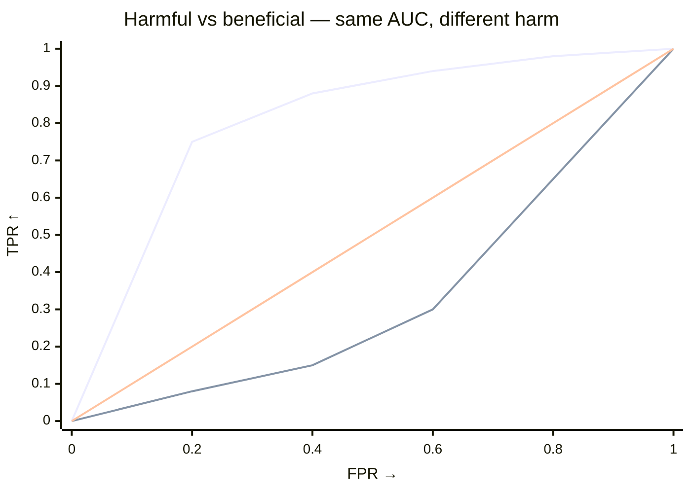

# Why the harm statistic is not just AUC

`test_shift` and `test_harmful_shift` share a permutation null but answer different questions.

- `test_shift` — did anything change? Two-sided AUC.
- `test_harmful_shift` — did target move toward worse outcomes? One-sided, source-anchored.

## At a glance

AUC averages separability uniformly. Harm emphasizes the **harmful tail** — thresholds source rarely exceeds but target clears.

> `AUC = ∫ TPR dFPR` (uniform) · Harm = `∫ TPR·(1-FPR)² dFPR` (favours low `FPR`).

If target piles mass in the harmful tail, harm grows; if it shifts elsewhere, it doesn't.

## Direction

Declare once — string or `ss.Worse` (interchangeable):

--8<-- "snippets/worse-table.txt"

Internally `polarity = scores if worse=="higher" else -scores` so larger always means worse. Everything below assumes transformed scores.

## What it integrates

Let `S` be the transformed score, target = positive class, threshold `t`:

- `FPR(t)=P(S>t|source)` (x-axis)
- `TPR(t)=P(S>t|target)` (y-axis)

Since `1-FPR = P(S≤t|source)=F̂_source(t)` (source ECDF):

$$
T = \int TPR\cdot(1-FPR)^2\,dFPR = \int TPR\cdot\hat{F}_{\text{source}}(t)^2\,dFPR
$$

`∫ TPR dFPR` = AUC (uniform) vs `∫ TPR·(1-FPR)² dFPR` = harm (weight peaks at low `FPR`, decays to 0 at `FPR=1`). Target that clears a high bar source stays below gets a large `T`.

### Visual intuition

*Harmful ROC jumps early (left, heavily weighted) → harm LARGE. Beneficial rises late (right, lightly weighted) → harm small but AUC still large.*

A shift toward *better* outcomes inflates AUC but not `T`. That's why `test_harmful_shift` is directional. Computation is `O(n log n)`.

## Properties

- **Directional** — excess mass at low `FPR` → large `T`.
- **Source-anchored** — weight is `F̂_source`, so the reference calibrates the comparison.
- **Robust to beneficial shift** — better-side movement inflates AUC but not `T`.

## Inference

Scores and weights stay fixed — only labels are permuted.

- **Null:** exchangeability — labels carry no information.
- **Procedure:** permute labels `n_resamples` times, recompute `T`.
- **p-value:** one-sided `greater` — fraction of null `T` ≥ observed, with +1 smoothing in `(0,1]`.

No parametric assumption. Weighted permutations permute the concatenated weight vector with labels.

--8<-- "snippets/n-resamples.txt"

Tip: compare `result.statistic` to `result.null_distribution`. For AUC, `0.5` is chance; for harm, compare to null median.

## AUC vs harm

|  | `test_shift` (AUC) | `test_harmful_shift` (harm) |
|---|---|---|
| Question | Did anything change? | Did target shift toward worse outcomes? |
| Statistic | `∫ TPR dFPR` | `∫ TPR·(1-FPR)² dFPR` |
| Weight | uniform | favours low `FPR` |
| Alternative | two-sided | one-sided `greater` |
| Sensitive to | any separability | directional excess over source |

Use `test_shift` when direction is unknown, `test_harmful_shift` once you can declare `worse`. See [Is it harmful?](../examples/tutorials/check-shift-harm.md).

## References

- Kamulete et al. (2022). Harmful shifts via scoring rules. *UAI*. [arXiv:2107.02990](https://arxiv.org/abs/2107.02990).
