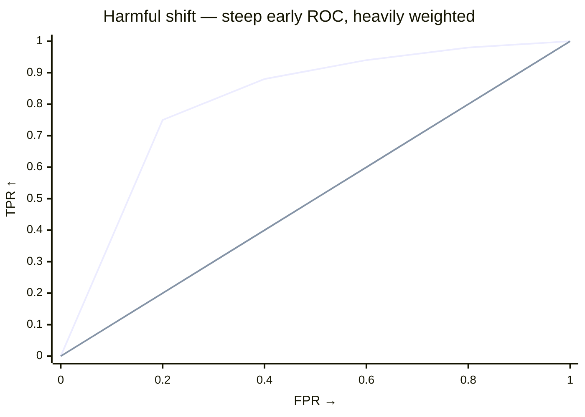
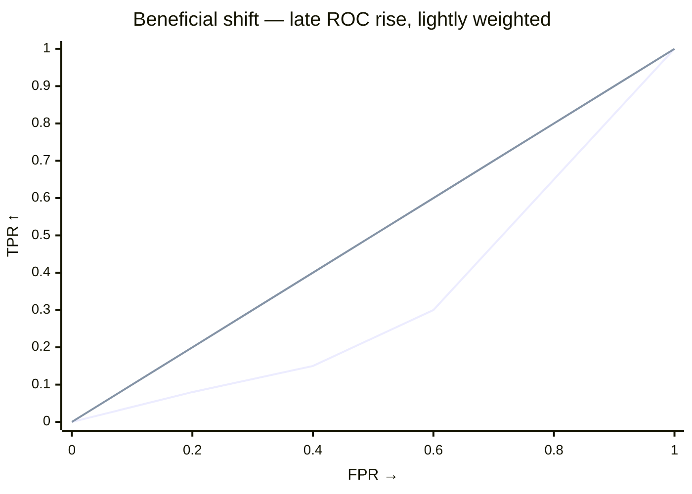

# Why the harm statistic is not just AUC

`test_shift` and `test_harmful_shift` share a permutation null but use different statistics for different questions.

- `test_shift` — **did anything change?** Two-sided ROC AUC.
- `test_harmful_shift` — **did target move toward worse outcomes?** One-sided, source-anchored.

## At a glance

AUC averages separability uniformly across the ROC curve. The harm statistic emphasizes the **harmful tail** — thresholds that source rarely exceeds but target clears. If target piles mass there, harm grows; if it shifts elsewhere, it doesn't.

> **Summary** — `AUC = ∫ TPR dFPR` (uniform). Harm = `∫ TPR·(1-FPR)² dFPR` (favours low `FPR`). Same null, different weighting.

## Direction: `worse` always means "larger" after the transform

Declare the harmful direction once (string or `ss.Worse`, interchangeable; enum gives autocomplete):

--8<-- "snippets/worse-table.txt"

Internally `polarity = scores if worse == "higher" else -scores` so larger always means worse. Everything below assumes transformed scores.

## What the harm statistic integrates

Treat target as the positive class and let `S` be the transformed score. For threshold `t`:

- `FPR(t) = P(S > t | source)` — x-axis
- `TPR(t) = P(S > t | target)` — y-axis

Since `1 - FPR(t) = P(S ≤ t | source) = F̂_source(t)` (source ECDF), the harm statistic is:

$$
T = \int TPR \cdot (1 - FPR)^{2} \, dFPR
  = \int TPR \cdot \hat{F}_{\text{source}}(t)^{2} \, dFPR.
$$

- `∫ TPR dFPR` = AUC (uniform).
- `∫ TPR·(1-FPR)² dFPR` = harm (weight `(1-FPR)²` favours low `FPR`).

`(1-FPR)²` peaks at low `FPR` — high thresholds source rarely exceeds — and decays to `0` at `FPR=1`. Target that clears a high bar source stays below gets a large `T`.

### Visual intuition

Harmful tail = low `FPR` (source rarely exceeds). Beneficial/symmetric = high `FPR`. Harm weighting `(1-FPR)²` is large at left, near zero at right.



*Alt: harmful ROC jumps to TPR≈0.75 at FPR=0.2 (left, heavily weighted) — Harm statistic LARGE, AUC large.*



*Alt: beneficial ROC stays low until FPR≈0.8 (right, lightly weighted) — Harm statistic small, AUC still large (wrong side).*

A shift toward *better* outcomes inflates two-sided AUC but not `T` — the mass is at high `FPR` where the weight `≈ 0`. That's why `test_harmful_shift` is directional.

Computation is `O(n log n)` via `roc_curve` + trapezoidal rule.

## What that buys you

- **Directional.** Excess mass in the harmful tail → high `TPR` at low `FPR` → large `T`.
- **Source-anchored.** Weight is `F̂_source`, so the reference calibrates the comparison.
- **Robust to beneficial shift.** Movement on the better side inflates AUC but not `T`.

## How inference works

Scores and weights stay fixed — only labels are permuted.

- **Null:** exchangeability — source and target share the same distribution, so labels carry no information.
- **Procedure:** permute labels `n_resamples` times, recompute `T` each time.
- **p-value:** one-sided `greater` — fraction of null `T` at least as large as observed.

--8<-- "snippets/pvalue-guidance.txt"

No parametric form for scores is assumed. Weighted permutations permute the concatenated weight vector with labels, preserving group sizes.

Permutation p-values use +1 smoothing (Phipson & Smyth) and lie in `(0, 1]`; doubling for two-sided `test_shift` is capped at `1`.

--8<-- "snippets/n-resamples.txt"

??? tip "Plot the null"
    Compare `result.statistic` to `result.null_distribution`. If observed lies beyond `quantile(null, 0.95)`, `p < 0.05`. For AUC, `0.5` is chance; for the harm statistic, compare to the null median — no fixed `0.5` reference.

??? example "Weighted permutation in code"
    ```python
    # src/samesame/_permutation.py
    sample_weight = np.concatenate((weights.source, weights.target))
    observed = metric(labels, scores, sample_weight)
    for i in range(n_resamples):
        perm_labels = rng.permutation(labels)
        null[i] = metric(perm_labels, scores, sample_weight)
    ```

## AUC vs the harm statistic

|  | `test_shift` (AUC) | `test_harmful_shift` (harm) |
|---|---|---|
| Question | Did anything change? | Did target shift toward worse outcomes? |
| Statistic | `∫ TPR dFPR` | `∫ TPR·(1-FPR)² dFPR` |
| Weight on ROC | uniform | favours low `FPR` (harmful tail) |
| Alternative | two-sided | one-sided `greater` |
| Sensitive to | any separability | directional excess over source support |

Use `test_shift` for "are they different?" Use `test_harmful_shift` once you can declare `worse` (`"higher"` or `"lower"`). Strings and `ss.Worse` enum are interchangeable. It won't flag neutral or beneficial shifts.

For a worked example, see [Test whether the shift is harmful](../examples/tutorials/check-shift-harm.md). For the API, see [Shift testing](../api/testing.md).

## References

- Kamulete, V. M., et al. (2022). Detecting harmful distribution shifts via scoring rules. *UAI*. [arXiv:2107.02990](https://arxiv.org/abs/2107.02990).
