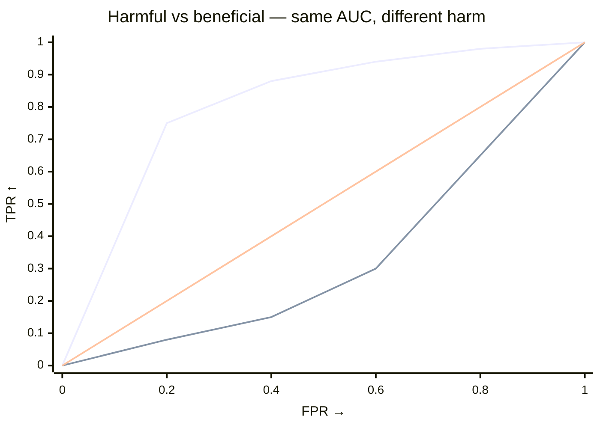

# How the harm test works

`test_shift` and `test_harmful_shift` share a permutation null but answer different questions:

- `test_shift` — did anything change? Two-sided AUC.
- `test_harmful_shift` — did target move toward worse outcomes? One-sided, source-anchored.

Scores and weights stay fixed; only labels are permuted.

## At a glance

AUC averages separability uniformly. Harm emphasizes the **harmful tail** — thresholds few source points clear but many target points do.

> `AUC = ∫ TPR dFPR` (uniform) · Harm = `∫ TPR·(1−FPR)² dFPR` (low-FPR weighted).

If target piles mass in the harmful tail, harm grows; if it shifts elsewhere, it doesn't.

## Direction

Declare once — string or `ss.Worse` (interchangeable):

--8<-- "snippets/worse-table.txt"

Internally `scores if worse=="higher" else -scores`, so larger always means worse.

## AUC vs harm

|  | `test_shift` (AUC) | `test_harmful_shift` (harm) |
|---|---|---|
| Question | Did anything change? | Did target shift toward worse? |
| Statistic | `∫ TPR dFPR` | `∫ TPR·(1−FPR)² dFPR` |
| Weight | uniform | favours low `FPR` (source-rare tail) |
| Alternative | two-sided | one-sided `greater` |

Use `test_shift` when direction is unknown; `test_harmful_shift` once you can declare `worse`. For AUC `0.5` is chance; for harm the scale has no fixed reference — compare observed to `result.null_distribution` median.

### Visual intuition

*Early rise (left, weighted)* → harm LARGE. *Late rise (right)* → harm small but AUC still large. That is why the test is directional — a shift toward better outcomes inflates AUC but not harm.

??? details "Formula (experts)"

    Let `S` be the polarity-adjusted score, target = positive class, threshold `t`:

    - `FPR(t)=P(S>t|source)` (x-axis)
    - `TPR(t)=P(S>t|target)` (y-axis)

    Since `1−FPR = F̂_source(t)` (source ECDF):

    $$
    T = \int TPR\cdot(1-FPR)^2\,dFPR = \int TPR\cdot\hat{F}_{\text{source}}(t)^2\,dFPR.
    $$

    Uniform weight gives AUC. Harm peaks at low `FPR` and decays to 0 at `FPR=1`. A target that clears a high bar source stays below gets large `T`. Cost is `O(n log n)`.

## References

- Kamulete, V. M. (2022). Test for non-negligible adverse shifts. *Proceedings of the 38th Conference on Uncertainty in Artificial Intelligence (UAI)*. [arXiv:2107.02990](https://arxiv.org/abs/2107.02990).
