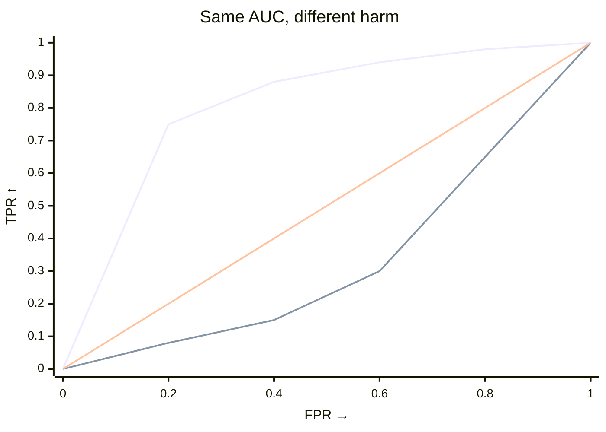

# How the harm test works

## Context: why a harmful-shift test exists

Some shifts move the middle while the harmful tail stays put, and a generic test still rejects. Means miss tail harm (for example, Netflix PlayDelay). The harm test asks the question your decision needs.

!!! note "The question"
    After orienting the interpretable severity score `ϕ(x)` so larger means worse, does the target place more mass beyond thresholds the source rarely exceeds?

Declare it with `worse`. Your choice of `ϕ` defines *worse* ([Core concepts](core-concepts.md); [Shift testing](../api/testing.md)). Same split, different `ϕ`: density can look safe while residual and confidence diverge (Kamulete 2022 §2, §6.2; [dsos: motivation](https://cran.r-project.org/web/packages/dsos/vignettes/motivation.html) (external)).

## What it is

Both tests permute labels with scores fixed and differ only in threshold weighting:

- `test_shift`: uniform, `∫ TPR dFPR` (AUC).
- `test_harmful_shift`: source-rare emphasis, `∫ TPR·(1−FPR)² dFPR = ∫ TPR·F̂_source² dFPR` with `F̂_source=1−FPR` (Kamulete 2022 §3; one-sided `greater`).

Near `0.5` means little separation. Read harm against its null. Use `test_shift` for any change and `test_harmful_shift` when you can state `worse` beforehand; no margin needed.

--8<-- "snippets/worse-declaration.txt"

--8<-- "snippets/worse-table.txt"

## How it fits

Early rise signals large harm. Late rise shows that large AUC can coexist with small harm. Same pattern on 70 trial scores in [Is the new drug good enough?](../examples/trials/check-drug-efficacy.md).

??? details "The formula"

    Orient so larger means worse: `S = scores` if `worse="higher"`, `S = -scores` otherwise. For threshold `t`:

    - `FPR(t) = P(S > t | source)`, `TPR(t) = P(S > t | target)`
    - `1 − FPR = F̂_source(t)` (source ECDF), so:

    $$
    T = \int TPR\cdot(1-FPR)^2\,dFPR = \int TPR\cdot\hat{F}_{\text{source}}(t)^2\,dFPR.
    $$

    `O(n log n)` per resample, `O(n)` memory.

## Related concepts

- **Common support:** Poor overlap lets a few points dominate. See [Weight for common support](../how-to/weight-for-common-support.md) and [Core concepts](core-concepts.md) (research case: unweighted/source/target `p=0.002`, doubly weighted `p=0.376`).
- **Honest scores:** Valid p-values need out-of-sample scores ([Core concepts](core-concepts.md); [Shift testing](../api/testing.md#honest-scores)).

## References

* Kamulete (2022). *UAI*, PMLR 180:959–968. [PMLR](https://proceedings.mlr.press/v180/kamulete22a.html) · [arXiv:2107.02990](https://arxiv.org/abs/2107.02990).
* Phipson & Smyth (2010). *Stat. Appl. Genet. Mol. Biol.* 9(1):Article 39. [doi:10.2202/1544-6115.1585](https://doi.org/10.2202/1544-6115.1585).

For weighting theory (Kish 1965; Bickel et al. 2007; Yamada et al. 2013; Elvira et al. 2022) see [Importance weights](../api/weighting.md).

One score and one declaration is enough. The test measures tail harm, not just any shift.
