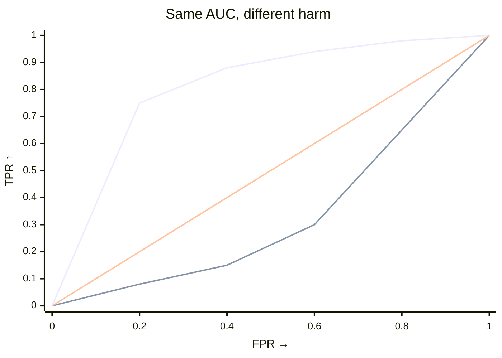

# How the harm test works

## The question

A distributional change is not necessarily a harmful change. For example, a
credit portfolio may contain fewer very safe applicants and more medium-risk
applicants while the high-risk tail remains unchanged. A generic shift test can
detect this redistribution, but it cannot determine whether the change is
harmful according to the outcome you care about.

The harmful-shift test asks a narrower question: after orienting the score so
that larger values mean worse outcomes, does the target place more mass beyond
thresholds that the source rarely exceeds? The API therefore requires an
explicit `worse` argument. Choose `worse` from the meaning of the score before
looking at the result, not from whichever direction produces a smaller p-value.

## What the tests average

Both tests use permutations to assess the same source-versus-target comparison,
keeping scores and weights fixed. `test_shift` treats all thresholds equally and
measures overall separation with AUC. `test_harmful_shift` emphasizes
thresholds that are rare in the source, so it is sensitive to target mass in the
harmful tail. Their exact statistics are:

- `test_shift`: `∫ TPR dFPR`
- `test_harmful_shift`: `∫ TPR·(1−FPR)² dFPR`

## AUC vs harm

|  | `test_shift` | `test_harmful_shift` |
|---|---|---|
| Question | Do source and target differ? | Did target move toward the specified harmful tail? |
| Statistic | AUC: `∫ TPR dFPR` | Weighted AUC: `∫ TPR·(1−FPR)² dFPR` |
| Threshold emphasis | Uniform | Low `FPR` (source-rare tail) |
| Direction | Two-sided | One-sided (`greater`) |

Use `test_shift` for a two-sided test when any score distributional change
matters. Use `test_harmful_shift` for a one-sided test when you can define the
harmful direction in advance and want to focus on the harmful tail. Interpret
AUC relative to its chance value of `0.5`; interpret the harmful-shift statistic
relative to `result.null_distribution`, using the p-value as evidence against
the null.

Declare the harmful direction from the meaning of the score before testing.
Pass it as a string or as `ss.Worse`; the two forms are interchangeable.

--8<-- "snippets/worse-table.txt"

## Intuition from the ROC curve

When the ROC curve rises early, many target observations exceed thresholds that
are rare in the source, so the harmful statistic is large. When it rises late,
the groups differ mainly in regions where the source already has substantial
mass. AUC can still be large in that case, but the harmful statistic is smaller.

Here, the ROC curve is an analysis tool for visualizing how a monitoring score
ranks target relative to source across thresholds. AUC summarizes performance
across all thresholds equally; the harmful statistic emphasizes thresholds
rarely exceeded by source observations.

??? details "Formula (experts)"

    First orient the score so that larger values mean worse outcomes: let
    `S=scores` when `worse=="higher"` and `S=-scores` when `worse=="lower"`.
    For threshold `t`, treat target as the positive class:

    - `FPR(t)=P(S>t|source)`, `TPR(t)=P(S>t|target)`
    - `1−FPR = F̂_source(t)` (the source ECDF), so:

    $$
    T = \int TPR\cdot(1-FPR)^2\,dFPR = \int TPR\cdot\hat{F}_{\text{source}}(t)^2\,dFPR.
    $$

    The factor `(1−FPR)^2` emphasizes thresholds that are rarely exceeded by
    source observations. Without this factor, uniform weighting gives AUC. Harm
    therefore peaks at low `FPR` and decays to `0` at `FPR=1`. The computation
    costs `O(n log n)` per resample and `O(n)` memory.

## References

* Kamulete, V. M. (2022). *Test for non-negligible adverse shifts*.
  *Proceedings of the 38th Conference on Uncertainty in Artificial
  Intelligence (UAI)*, PMLR 180:959-968.
  [PMLR](https://proceedings.mlr.press/v180/kamulete22a.html) ·
  [arXiv:2107.02990](https://arxiv.org/abs/2107.02990).
* Phipson, B., Smyth, G. K. (2010). *Permutation P-values should never be
  zero: calculating exact P-values when permutations are randomly drawn*.
  *Statistical Applications in Genetics and Molecular Biology* 9(1):Article 39.
  https://doi.org/10.2202/1544-6115.1585 — the ``+1`` smoothing used for both tests.
* Kish, L. (1965). *Survey Sampling*. Wiley — Kish's ``(sum w)² / sum w²`` effective sample size.
* Bickel, S., Brückner, M., Scheffer, T. (2007). *Discriminative learning for
  differing training and test distributions*. *ICML* 24:81-88.
  https://doi.org/10.1145/1273496.1273507 — density ratio ``r = p/(1-p)·n_s/n_t``.
* Yamada, M. et al. (2013). *Relative density-ratio estimation for robust
  distribution comparison*. *Neural Comput.* 25(5):1324-1370.
  https://doi.org/10.1162/NECO_a_00442 — relative importance weighting with ``λ``.
* Elvira, V. et al. (2022). *Rethinking the effective sample size*.
  *Int. Stat. Rev.* 90(3):525-550 — caveats on ESS thresholds (no universal ``n/4`` cutoff).
