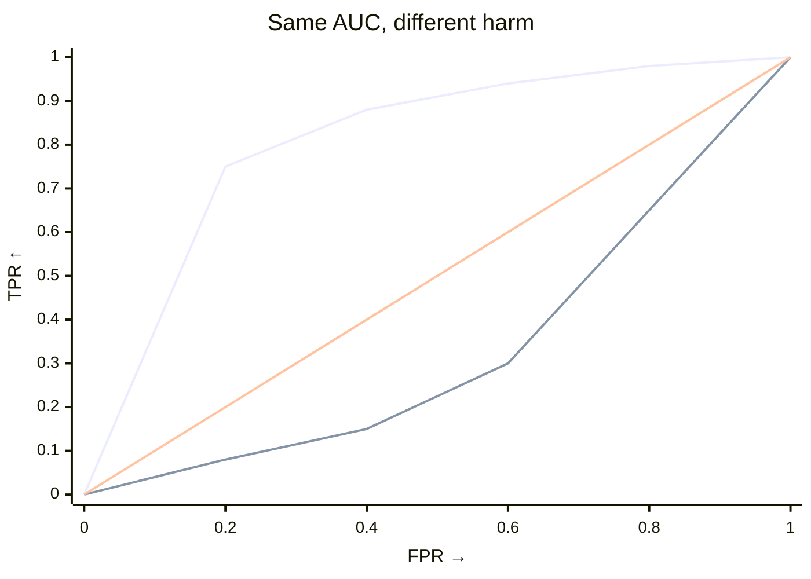

# How the harm test works

## Context: why a harmful-shift test exists

A distribution can change without getting worse. A credit portfolio might hold fewer very safe applicants and more medium-risk ones while the high-risk tail stays put, and a generic shift test will still reject. Means miss tail harm in the same way (Netflix PlayDelay is one example). The harm test asks the narrower question your decision actually needs.

!!! note "The question"
    After orienting the interpretable severity score `ϕ(x)` so larger means worse, does the target place more mass beyond thresholds the source rarely exceeds?

Declare it with `worse`, chosen from what `ϕ` means rather than from p-values. Your choice of `ϕ` defines *worse* ([Core concepts](core-concepts.md); [Shift testing](../api/testing.md)). The same split can read differently through different scores: density can look safe while residual and confidence diverge (Kamulete 2022 §2, §6.2; [dsos: motivation](https://cran.r-project.org/web/packages/dsos/vignettes/motivation.html) (external)).

## What it is

Both tests permute labels with scores fixed and differ only in how they weight thresholds:

- `test_shift`: uniform weight, `∫ TPR dFPR` (AUC).
- `test_harmful_shift`: weight toward source-rare thresholds, `∫ TPR·(1−FPR)² dFPR = ∫ TPR·F̂_source² dFPR` with `F̂_source=1−FPR` (Kamulete 2022 §3; one-sided `greater`).

Near `0.5` means little separation, so read harm against its null. Reach for `test_shift` when any change matters and `test_harmful_shift` when you can name `worse` beforehand; neither needs a margin.

--8<-- "snippets/worse-declaration.txt"

--8<-- "snippets/worse-table.txt"

## How it fits

Early rise means many target observations cross a threshold almost no source observations cross, so harm is large. Late rise means the groups differ mainly where source already has plenty of mass: AUC can still be large while harm stays small. You'll see the same pattern in the 70 trial scores in [Is the new drug good enough?](../examples/trials/check-drug-efficacy.md).

The ROC picture is a ranking intuition, not a claim that your score is a production classifier. It asks how well the score ranks target above source across thresholds. AUC weights those thresholds uniformly; the harm statistic gives extra weight where source rarely ventures.

??? details "The formula"

    Orient so larger means worse: `S = scores` if `worse="higher"`, `S = -scores` otherwise. For threshold `t`:

    - `FPR(t) = P(S > t | source)`, `TPR(t) = P(S > t | target)`
    - `1 − FPR = F̂_source(t)` (source ECDF), so:

    $$
    T = \int TPR\cdot(1-FPR)^2\,dFPR = \int TPR\cdot\hat{F}_{\text{source}}(t)^2\,dFPR.
    $$

    `O(n log n)` per resample, `O(n)` memory.

## Related concepts

- **Common support:** poor overlap lets a few points dominate. See [Weight for common support](../how-to/weight-for-common-support.md) and [Core concepts](core-concepts.md) (one research case moves from `p=0.002` unweighted to `p=0.376` doubly weighted).
- **Honest scores:** valid p-values need out-of-sample scores ([Core concepts](core-concepts.md); [Shift testing](../api/testing.md#honest-scores)).

## References

* Kamulete (2022). *UAI*, PMLR 180:959–968. [PMLR](https://proceedings.mlr.press/v180/kamulete22a.html) · [arXiv:2107.02990](https://arxiv.org/abs/2107.02990).
* Phipson & Smyth (2010). *Stat. Appl. Genet. Mol. Biol.* 9(1):Article 39. [doi:10.2202/1544-6115.1585](https://doi.org/10.2202/1544-6115.1585).

For weighting theory (Kish 1965; Bickel et al. 2007; Yamada et al. 2013; Elvira et al. 2022) see [Importance weights](../api/weighting.md).

One score and one declaration is enough to get started. The test measures tail harm, not just any shift.
