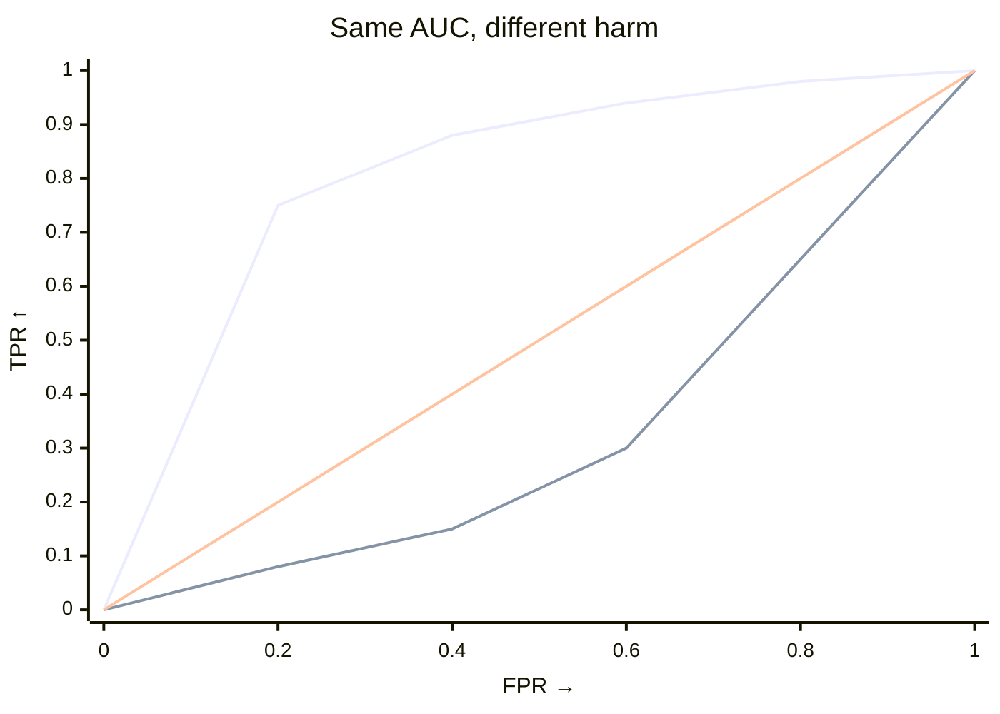

# How the harm test works

## The question

A distribution can change without becoming worse. For example, a credit
portfolio may contain fewer very safe applicants and more medium-risk
applicants, while the high-risk tail stays unchanged. A generic shift test can
detect that redistribution, but it cannot decide whether it matters to your
harm definition.

The harmful-shift test answers a narrower question: after orienting the score
so that larger values mean worse outcomes, does target have excess mass beyond
thresholds that source rarely exceeds? This is why the API requires an
explicit `worse` argument. Choose the direction from domain meaning, not from
whichever direction happens to produce a smaller p-value.

## What the tests average

Both tests permute labels with scores (and weights) fixed. They differ in what they average over thresholds:

- `test_shift` — uniform weight. Statistic is AUC (`∫ TPR dFPR`).
- `test_harmful_shift` — low-FPR weight. Statistic is `∫ TPR·(1−FPR)² dFPR`. Harm is large only when target piles mass past thresholds source rarely clears.

## AUC vs harm

|  | `test_shift` | `test_harmful_shift` |
|---|---|---|
| Question | Did anything change? | Did target shift toward worse? |
| Statistic | `∫ TPR dFPR` (AUC) | `∫ TPR·(1−FPR)² dFPR` |
| Weight | uniform | favours low `FPR` (source-rare tail) |
| Alternative | two-sided | one-sided `greater` |

Use `test_shift` when direction is unknown or when any change matters. Use
`test_harmful_shift` when you can define the harmful direction in advance and
want to prioritise the harmful tail. For AUC, `0.5` is chance. Harm has no
fixed scale: compare the observed statistic with
`result.null_distribution`, and use the p-value for evidence against the null.

Declare the direction once — string or `ss.Worse` (interchangeable):

--8<-- "snippets/worse-table.txt"

## Intuition from the ROC curve

Early rise (left, weighted) means that many target observations cross a
threshold that almost no source observations cross: harm is large. A late rise
means the groups differ mainly where source already has substantial mass: AUC
can still be large, but the harmful statistic is smaller.

The ROC picture is a ranking intuition, not a claim that the score is a
classifier used in production. It asks how well the score ranks target above
source across all possible thresholds. AUC weights those thresholds uniformly;
the harmful statistic gives more weight to low source false-positive rates.

??? details "Formula (experts)"

    Let `S` be the polarity-adjusted score (`scores if worse=="higher" else -scores`), target = positive class, threshold `t`:

    - `FPR(t)=P(S>t|source)`, `TPR(t)=P(S>t|target)`
    - `1−FPR = F̂_source(t)` (source ECDF), so:

    $$
    T = \int TPR\cdot(1-FPR)^2\,dFPR = \int TPR\cdot\hat{F}_{\text{source}}(t)^2\,dFPR.
    $$

    Uniform weight gives AUC. Harm peaks at low `FPR` and decays to 0 at `FPR=1`. Cost is `O(n log n)` per resample, `O(n)` memory.

## References

- Kamulete, V. M. (2022). Test for non-negligible adverse shifts. *Proceedings of the 38th Conference on Uncertainty in Artificial Intelligence (UAI)*. [arXiv:2107.02990](https://arxiv.org/abs/2107.02990).
