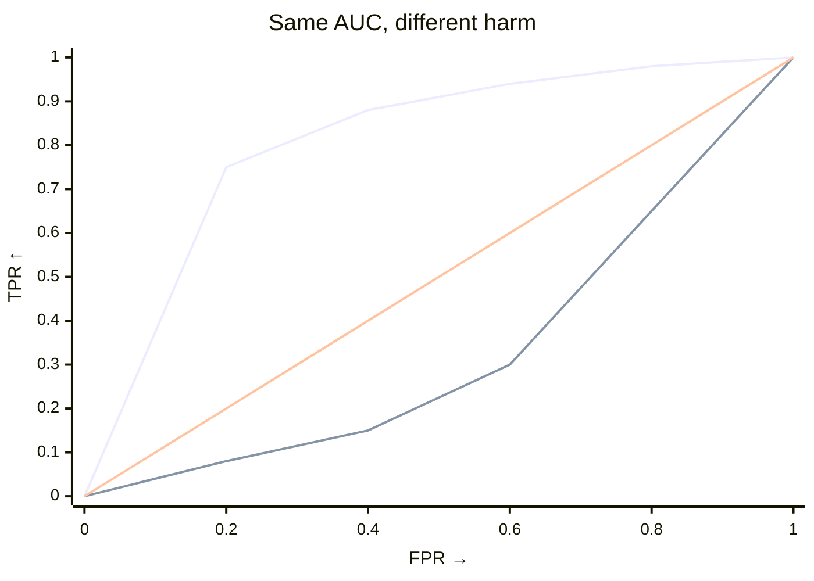

# How the harm test works

## The question

Not every shift is a harmful shift. A credit portfolio, for example, may contain fewer safe applicants and more medium-risk applicants while the high-risk tail stays the same. A generic shift test detects this redistribution, but it cannot say whether the change is harmful for the outcome you care about.

The harmful-shift test asks a narrower question. After orienting the score so that larger values mean worse outcomes, does the target place more mass beyond thresholds that the source rarely exceeds? The API therefore requires you to declare the harmful direction with `worse`.

--8<-- "snippets/worse-tip.txt"

## What the tests measure

Both tests use permutations on the same source-versus-target comparison, keeping scores and weights fixed. `test_shift` weighs all thresholds equally and summarizes overall separation with the ROC AUC. `test_harmful_shift` gives extra weight to thresholds that are rare in the source, so it responds more to target mass in the harmful tail. Their statistics are:

- `test_shift`: `∫ TPR dFPR`
- `test_harmful_shift`: `∫ TPR·(1−FPR)² dFPR`

## AUC versus harm

|  | `test_shift` | `test_harmful_shift` |
|---|---|---|
| Question | Do source and target differ? | Did the target move toward the harmful tail you specified? |
| Statistic | AUC: `∫ TPR dFPR` | Weighted AUC: `∫ TPR·(1−FPR)² dFPR` |
| Threshold weighting | Uniform | Emphasis on low `FPR` — the source-rare tail |
| Direction | Two-sided | One-sided (`greater`) |

Use `test_shift` when any change in the score distribution matters. Use `test_harmful_shift` when you can define the harmful direction in advance and want to focus on that tail. An AUC near `0.5` means little separation; read the harmful-shift statistic against `result.null_distribution` and use its p-value as evidence against the null.

--8<-- "snippets/worse-declaration.txt"

--8<-- "snippets/worse-table.txt"

## Intuition from the ROC curve

When the ROC curve rises early, many target observations exceed thresholds that the source rarely exceeds, so the harmful-shift statistic is large. When the curve rises late, the groups differ mainly where the source already has substantial mass. The AUC can still be large in that case, but the harmful-shift statistic stays smaller.

In this view, the ROC curve is a diagnostic: it shows how a monitoring score ranks target against source across thresholds. The AUC summarizes performance uniformly across all thresholds; the harmful-shift statistic concentrates on thresholds the source rarely exceeds. For a concrete illustration on 70 real trial scores, see [Is the new drug good enough?](../examples/trials/check-drug-efficacy.md).

??? details "The formula"

    First orient the score so larger values mean worse outcomes: set `S = scores` when `worse == "higher"` and `S = -scores` when `worse == "lower"`. For a threshold `t`, treat target as the positive class:

    - `FPR(t) = P(S > t | source)`, `TPR(t) = P(S > t | target)`
    - `1 − FPR = F̂_source(t)` (the source ECDF), so:

    $$
    T = \int TPR\cdot(1-FPR)^2\,dFPR = \int TPR\cdot\hat{F}_{\text{source}}(t)^2\,dFPR.
    $$

    The factor `(1−FPR)²` gives the most weight to thresholds the source rarely exceeds. Without it, uniform weighting yields the AUC. Harm therefore peaks at low `FPR` and falls to `0` at `FPR = 1`. The computation costs `O(n log n)` per resample and `O(n)` memory.

## References

* Kamulete, V. M. (2022). *Test for non-negligible adverse shifts*. *Proceedings of the 38th Conference on Uncertainty in Artificial Intelligence (UAI)*, PMLR 180:959–968. [PMLR](https://proceedings.mlr.press/v180/kamulete22a.html) · [arXiv:2107.02990](https://arxiv.org/abs/2107.02990).
* Phipson, B., Smyth, G. K. (2010). *Permutation P-values should never be zero: calculating exact P-values when permutations are randomly drawn*. *Statistical Applications in Genetics and Molecular Biology* 9(1):Article 39. [doi:10.2202/1544-6115.1585](https://doi.org/10.2202/1544-6115.1585) — the `+1` smoothing used for both tests.
* Kish, L. (1965). *Survey Sampling*. Wiley — Kish's `(sum w)² / sum w²` effective sample size.
* Bickel, S., Brückner, M., Scheffer, T. (2007). *Discriminative learning for differing training and test distributions*. *ICML* 24:81–88. [doi:10.1145/1273496.1273507](https://doi.org/10.1145/1273496.1273507) — density ratio `r = p/(1−p) · n_s/n_t`.
* Yamada, M. et al. (2013). *Relative density-ratio estimation for robust distribution comparison*. *Neural Comput.* 25(5):1324–1370. [doi:10.1162/NECO_a_00442](https://doi.org/10.1162/NECO_a_00442) — relative importance weighting with `λ`.
* Elvira, V. et al. (2022). *Rethinking the effective sample size*. *Int. Stat. Rev.* 90(3):525–550 — cautions on ESS thresholds (no universal `n/4` cutoff).
