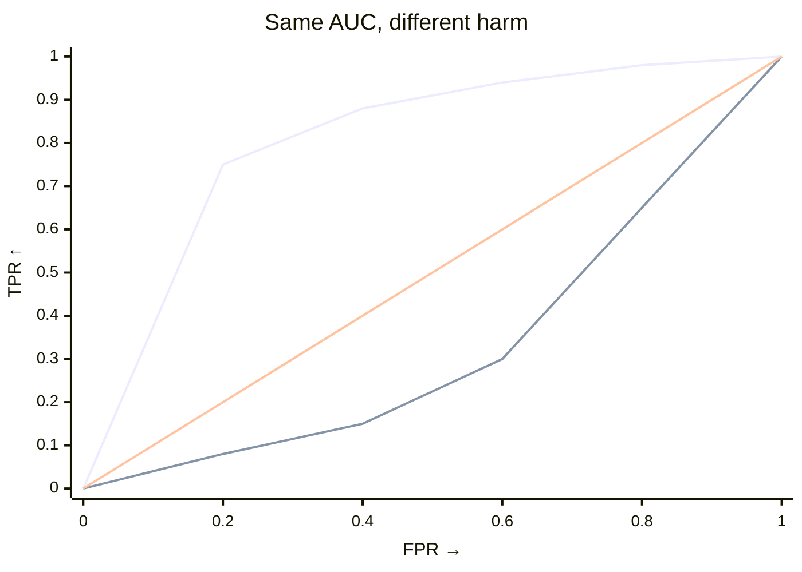

# How the harm test works

Both tests permute labels with scores (and weights) fixed. They differ in what they average over thresholds:

- `test_shift` — uniform weight. Statistic is AUC (`∫ TPR dFPR`).
- `test_harmful_shift` — low-FPR weight. Statistic is `∫ TPR·(1−FPR)² dFPR`. Harm is large only when target piles mass past thresholds source rarely clears.

## AUC vs harm

|  | `test_shift` | `test_harmful_shift` |
|---|---|---|
| Question | Did anything change? | Did target shift toward worse? |
| Statistic | `∫ TPR dFPR` (AUC) | `∫ TPR·(1−FPR)² dFPR` |
| Weight | uniform | favours low `FPR` (source-rare tail) |
| Alternative | two-sided | one-sided `greater` |

Use `test_shift` when direction is unknown; `test_harmful_shift` once you can declare `worse`. For AUC `0.5` is chance; harm has no fixed scale — compare observed to `result.null_distribution` median.

Declare the direction once — string or `ss.Worse` (interchangeable):

--8<-- "snippets/worse-table.txt"

## Visual

Early rise (left, weighted) → harm large. Late rise (right) → harm small but AUC still large. *Text fallback: harm weights the left side of the ROC (low FPR); AUC weights uniformly.* That's why the test is directional — a shift toward better outcomes inflates AUC but not harm.

??? details "Formula (experts)"

    Let `S` be the polarity-adjusted score (`scores if worse=="higher" else -scores`), target = positive class, threshold `t`:

    - `FPR(t)=P(S>t|source)`, `TPR(t)=P(S>t|target)`
    - `1−FPR = F̂_source(t)` (source ECDF), so:

    $$
    T = \int TPR\cdot(1-FPR)^2\,dFPR = \int TPR\cdot\hat{F}_{\text{source}}(t)^2\,dFPR.
    $$

    Uniform weight gives AUC. Harm peaks at low `FPR` and decays to 0 at `FPR=1`. Cost is `O(n log n)` per resample, `O(n)` memory.

## References

- Kamulete, V. M. (2022). Test for non-negligible adverse shifts. *Proceedings of the 38th Conference on Uncertainty in Artificial Intelligence (UAI)*. [arXiv:2107.02990](https://arxiv.org/abs/2107.02990).
