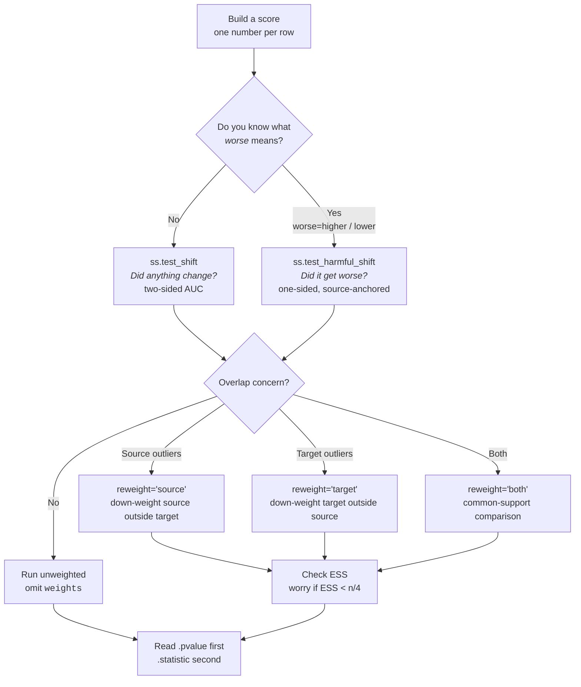

<!-- markdownlint-disable MD041 -->
<!-- markdownlint-disable MD033 -->

# samesame

<!-- badges: start -->
[](https://github.com/vathymut/samesame)
[](https://pypi.org/project/samesame/)
[](https://pepy.tech/project/samesame)
[](https://vathymut.github.io/samesame/)
[](https://arxiv.org/abs/2107.02990)
[](https://github.com/astral-sh/uv)
[](https://github.com/astral-sh/ruff)
<!-- badges: end -->

**Did the target shift? Did it get worse?**

`samesame` tests any scalar score — predicted risk, prediction error, or outlier score — for change between a **source** (reference: training or past batch) and a **target** (evaluation: production or new batch).

Two questions, two functions:

- **Did anything change?** `samesame.test_shift` — two-sided, any difference.
- **Did it get worse?** `samesame.test_harmful_shift` — one-sided, needs `worse="higher"` or `worse="lower"`.

## Quick example

```python
import numpy as np
import samesame as ss

rng = np.random.default_rng(12345)
source_scores = rng.normal(loc=0.0, scale=1.0, size=600)
target_scores = rng.normal(loc=0.6, scale=1.0, size=600)

shift = ss.test_shift(source=source_scores, target=target_scores, rng=rng)
harm = ss.test_harmful_shift(
    source=source_scores,
    target=target_scores,
    worse="higher",  # larger = more harm (e.g., risk)
    rng=rng,
)

print(f"Shift statistic: {shift.statistic:.3f}, p-value: {shift.pvalue:.4f}")
print(f"Harm  statistic: {harm.statistic:.3f}, p-value: {harm.pvalue:.4f}")
```

Small p-value (typically ≤ 0.05) is evidence against the null. Read `.pvalue` first; use `.statistic` for magnitude. `test_shift` rejects for any difference; `test_harmful_shift` rejects only for excess mass in the harmful tail you declared.

--8<-- "snippets/honest-scores.txt"

## Choose a signal

| Signal | What it measures | `worse` |
|--------|------------------|---------|
| Predicted risk | business impact | `higher` |
| Prediction error (Brier, log-loss) | accuracy once labels arrive | `higher` |
| Outlier score — confidence (`LogitGap`) | certainty / typicality | `lower` |
| Outlier score — atypicality | distance from source | `higher` |

Domain probability `P(target | x)` is not a harm signal — use it to build weights (below), not as the score you test for harm.

Any scalar score works; `samesame` provides only the test.

## The workflow

1. **Build a score** for source and target.
2. **Test any change** with `ss.test_shift`.
3. **Test harm** with `ss.test_harmful_shift(..., worse=...)` when direction matters.

Both tests are permutation-based (default `n_resamples=9999`; `999` while exploring, `19999` for `p < 0.001`; `O(n log n)` per resample). When source and target cover different feature regions, `ss.domain_weights` focuses the comparison on [common support](explanation/importance-weights-rationale.md).

## Decide what to run



If the diagram doesn't render, the rule is: **unweighted first, `test_shift` when direction is unknown, `test_harmful_shift` when you can declare `worse`, and weight only when you have a domain classifier and low overlap.** See [Glossary](explanation/glossary.md) and [When importance weights help](explanation/importance-weights-rationale.md).

## Where to go next

**Tutorials** — learn the workflow end-to-end (start here if new):

- [Detect any distributional shift](examples/tutorials/detect-distribution-shift.md) — your first shift test.
- [Test whether the shift is harmful](examples/tutorials/check-shift-harm.md) — add `worse` and interpret direction.
- [Adjust for covariate shift with importance weights](examples/tutorials/adjust-for-covariate-shift.md) — when feature support differs.

**How-to guides** — solve a specific task:

*Credit monitoring:*

- [Monitor predicted credit risk](examples/credit/monitor-credit-risk.md) — label-free business-risk workflow.
- [Monitor model confidence](examples/credit/monitor-model-confidence.md) — when certainty matters.
- [Monitor prediction errors once labels arrive](examples/credit/monitor-prediction-errors.md) — direct accuracy check.

*Common support (weighting):*

- [Focus harmful-shift testing on common support](examples/weighting/source-reweighting.md) — down-weight source outliers.
- [Restrict testing to common support on both sides](examples/weighting/double-weighting.md) — both groups have low-overlap regions.
- [Diagnose weight concentration with effective sample size](examples/weighting/diagnose-weight-concentration.md) — check a weighted result is not driven by a few points.

## Installation

```bash
python -m pip install samesame
```

Requires Python 3.12+, `numpy`, `scipy`, `scikit-learn`.
